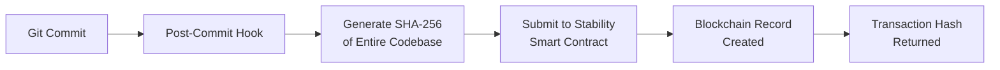

# Stability Blockchain Version Control

[](https://opensource.org/licenses/MIT)
[](https://stabilityprotocol.com/)
[](https://docs.stble.io/developers/zkt)

> **Decentralized Git with blockchain-verified immutability**

Transform your Git workflow into a tamper-proof, blockchain-verified version control system using Stability's Zero-Knowledge Transactions (ZKT). Every commit becomes an immutable record on the blockchain with zero gas fees.

## 🌟 Features

- **🔗 Blockchain Integration**: Automatic commit recording on Stability blockchain
- **⛽ Zero Gas Fees**: Powered by Stability's gasless ZKT technology
- **🔒 Tamper-Proof History**: SHA-256 hashed codebase with immutable blockchain storage
- **📊 Smart Contract Storage**: Structured data storage with queryable commit history
- **🚀 Git Hook Automation**: Seamless integration with existing Git workflows
- **🔍 Verification Tools**: Built-in verification and audit capabilities
- **🌐 Network Support**: Testnet and mainnet deployment options
- **📱 Cross-Platform**: Works on Windows, macOS, and Linux

## 🏗️ How It Works



1. **Developer makes a Git commit** - Normal Git workflow
2. **Post-commit hook triggers** - Automatic blockchain submission
3. **Codebase hashing** - SHA-256 of entire repository state
4. **Smart contract call** - Structured data submission via ZKT
5. **Immutable record** - Permanent blockchain storage with transaction hash

## 🚀 Quick Start

### 1. Clone and Setup

```bash
git clone https://github.com/your-username/stability-blockchain-version-control.git
cd stability-blockchain-version-control
```

### 2. Deploy Smart Contract (One-time)

```bash
bash scripts/deploy-contract.sh deploy mainnet
```

### 3. Install in Your Git Repository

```bash
cd /path/to/your/git/repo
bash /path/to/stability-version-control/scripts/install-hook.sh
```

### 4. Start Committing!

```bash
git add .
git commit -m "My first blockchain-verified commit"
# 🎉 Commit is now recorded on Stability blockchain!
```

## 📋 Installation

### Prerequisites

- **Git** (any recent version)
- **curl** (for API requests)
- **bash** (Git Bash on Windows)
- **Node.js** (optional, for advanced features)

### Automated Installation

```bash
# Install Git hook in current repository
bash scripts/install-hook.sh

# Run quick test to verify setup
bash scripts/quick-test.sh

# Deploy your own smart contract (optional)
bash scripts/deploy-contract.sh deploy mainnet
```

### Manual Installation

1. Copy `hooks/post-commit` to your Git repository's `.git/hooks/`
2. Copy `config/stability-config.sh` and configure your settings
3. Make hook executable: `chmod +x .git/hooks/post-commit`

## ⚙️ Configuration

### Basic Configuration (`config/stability-config.sh`)

```bash
# Network Configuration
export STABILITY_ZKT_ENDPOINT="https://rpc.stabilityprotocol.com/zkt"  # Mainnet
export STABILITY_NETWORK="mainnet"

# Smart Contract (deploy your own or use shared)
export STABILITY_CONTRACT_ADDRESS="0x8dda20DC43e4e3379d771adF8808C83959a246d2"

# Project Settings
export PROJECT_NAME="My Blockchain Project"

# Optional: Private endpoint (faster, requires API key)
export STABILITY_API_KEY=""  # Leave empty for public endpoint
```

### Network Options

| Network     | Endpoint                                        | Purpose             |
| ----------- | ----------------------------------------------- | ------------------- |
| **Mainnet** | `https://rpc.stabilityprotocol.com/zkt`         | Production use      |
| **Testnet** | `https://rpc.testnet.stabilityprotocol.com/zkt` | Development/testing |

## 🧪 Testing

### Quick Test

```bash
bash scripts/quick-test.sh
```

### Smart Contract Test

```bash
bash scripts/deploy-contract.sh test [CONTRACT_ADDRESS] [NETWORK]
```

### Complete Demo

```bash
bash scripts/demo-complete.sh
```

## 📊 Usage Examples

### View Blockchain Logs

```bash
cat logs/stability-hook.log
```

### Verify Commits

```bash
# Check latest commits stored on blockchain
bash scripts/verify-commits.sh

# Verify specific commit
bash scripts/verify-commits.sh abc123def456
```

### Query Smart Contract

```bash
# Get total commits stored
bash scripts/deploy-contract.sh test [CONTRACT_ADDRESS] mainnet

# Query specific commit (requires contract interaction tools)
```

## 🔧 Advanced Usage

### Custom Smart Contract

Deploy your own contract for private use:

```bash
# Deploy to testnet first
bash scripts/deploy-contract.sh deploy testnet

# Deploy to mainnet when ready
bash scripts/deploy-contract.sh deploy mainnet
```

### Multiple Repository Setup

```bash
# Install across multiple repositories
for repo in repo1 repo2 repo3; do
    cd $repo
    bash /path/to/stability-version-control/scripts/install-hook.sh
done
```

### CI/CD Integration

Add to your GitHub Actions workflow:

```yaml
- name: Setup Blockchain Version Control
  run: |
    bash scripts/install-hook.sh
    # Commits in CI will now be blockchain-verified
```

## 🛡️ Security

### Data Privacy

- **Metadata Only**: Only commit hashes, author, and timestamps are stored
- **No Source Code**: Actual code never leaves your system
- **Hash Verification**: SHA-256 ensures data integrity

### Best Practices

- Use private API endpoints for sensitive projects
- Deploy private smart contracts for confidential work
- Regular verification of blockchain records
- Secure API key management

## 📖 API Reference

### ZKT Endpoints

| Endpoint          | Type    | Description           |
| ----------------- | ------- | --------------------- |
| `/zkt/try-it-out` | Public  | Free, rate-limited    |
| `/zkt/{api-key}`  | Private | Authenticated, faster |

### Smart Contract Functions

```solidity
// Store a commit
function storeCommit(
    string commitHash,
    string codebaseHash,
    string author,
    string authorEmail,
    string branch,
    string message,
    string projectName
) external

// Retrieve commit data
function getCommit(string commitHash) external view returns (...)

// Check if commit exists
function commitExists(string commitHash) external view returns (bool)

// Get total commits
function getTotalCommits() external view returns (uint256)
```

## 🐛 Troubleshooting

### Common Issues

**Hook not triggering:**

```bash
# Check hook permissions
ls -la .git/hooks/post-commit
chmod +x .git/hooks/post-commit
```

**Configuration errors:**

```bash
# Verify config file
source config/stability-config.sh
echo $STABILITY_ZKT_ENDPOINT
```

**Network issues:**

```bash
# Test API connectivity
curl -s https://rpc.stabilityprotocol.com/zkt/try-it-out
```

**Windows-specific issues:**

- Use Git Bash instead of PowerShell
- Ensure proper line endings (LF, not CRLF)
- Check file paths use forward slashes

### Debug Mode

Enable verbose logging:

```bash
export DEBUG=1
git commit -m "Debug test commit"
```

## 🤝 Contributing

We welcome contributions! Please see [CONTRIBUTING.md](CONTRIBUTING.md) for guidelines.

### Development Setup

```bash
git clone https://github.com/your-username/stability-blockchain-version-control.git
cd stability-blockchain-version-control

# Run tests
bash scripts/quick-test.sh

# Deploy to testnet for development
bash scripts/deploy-contract.sh deploy testnet
```

### Reporting Issues

Please include:

- Operating system and version
- Git version (`git --version`)
- Full error logs from `logs/stability-hook.log`
- Steps to reproduce

## 📄 License

This project is licensed under the MIT License - see the [LICENSE](LICENSE) file for details.

## 🙋 Support

- **Documentation**: [Full docs available](docs/)
- **Issues**: [GitHub Issues](https://github.com/your-username/stability-blockchain-version-control/issues)
- **Discussions**: [GitHub Discussions](https://github.com/your-username/stability-blockchain-version-control/discussions)
- **Stability Network**: [Official docs](https://docs.stble.io/)

## 🚀 Roadmap

- [ ] **Multi-chain support** (Ethereum, Polygon)
- [ ] **Web dashboard** for commit visualization
- [ ] **Team collaboration** features
- [ ] **Git LFS integration** for large files
- [ ] **Advanced verification** tools
- [ ] **IDE plugins** (VS Code, IntelliJ)

## ⭐ Acknowledgments

- **Stability Protocol** for gasless blockchain infrastructure
- **Git community** for the foundational version control system
- **Open source contributors** who make this project possible

---

**Made with ❤️ for the decentralized future of version control**


